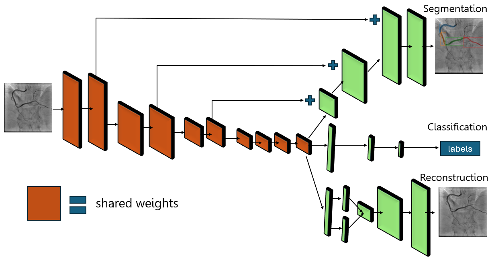

# Vessel Segmentation with Deep Learning

## The ARCADE Vessel Segmentation Challenge

- **Adi Hatav** | adi.hatav@campus.technion.ac.il
- **Zvi Badash** | zvi.badash@campus.technion.ac.il

### Project Overview
This project was based on the ARCADE Challenge. This challenge focused on the segmentation of 25 different classes of vessels from X-ray angiography images. Our approach combined segmentation, classification and reconstruction tasks, utilizing an encoder-decoder network architecture with combined encoder to all 3 tasks. This setup allowed the encoder to learn richer features by incorporating signals from reconstruction (preserving detailed information) and classification (focusing on discriminative features), leading to more effective segmentation.

### Challenge Results
Our final model achieved an F1 score of **0.3646**, placing us:
- **19th out of 393** teams in Phase 1 (only 4 different research groups outperformed us)
- **18th out of 42** teams in the Final Phase (only 6 different research groups outperformed us)

## Instructions 
### 1) How to use?
    1.1) Create a virtual env using `python -m venv .venv`
    1.2) Activate it `source .venv/bin/activate`
    1.3) Install all dependencies using `pip install -r requirements.txt`
    1.4) Fetch the data and run a perliminary train cycle using `./fetch_data_and_train.sh`
        1.4.1) If does not work, try `chmod +x ./fetch_data_and_train.sh` first
        1.4.2) Return to 1.4
    1.5) You will be prompted to login to a W&B account
    1.6) The train session should begin now

### 2) How to reproduce our results?
    2.1) The hyper-parameters random search can bt ran using `python hpt-tuning.py`
    2.2) The final run of the model from which we creat our plots and evaluate performance is obtained using `python final_run.py`
    2.3) The main results and plots can be made by running the notebook `plots.ipynb` and `test_model.ipynb` * (See note)

**Note:** Ensure that the `model_path` variable in the `test_model.ipynb` notebook is correctly set based on the W&B run.

### 3) Data
    3.1) All initial data handling can be found in `fetch_data.py` and the data URL is defined there
